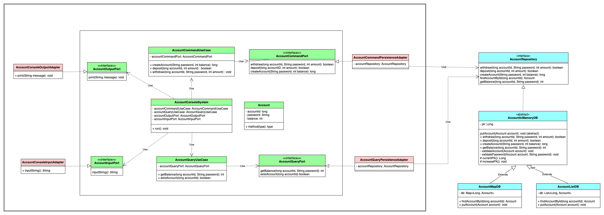

## 🏛️  클래스 다이어그램

---


## 📃 시나리오

---

```markdown
1. 계좌 시스템 실행
2. 입출금, 잔액 조회, 계좌 생성업무, 종료 선택 
   2.1. 입출금 
    2.1.1 입금
      2.1.1.1 입금할 계좌번호 입력
      2.1.1.2 입금할 금액 입력
      2.1.1.3 정삽 입금 안내 후 2번으로 돌아감. 
    2.1.2 출금 
      2.1.2.1 출금할 계좌번호 입력
      2.1.2.2 출금할 계좌의 비밀번호 입력
      2.1.2.3 출금할 금액 입력
      2.1.2.4 정상 출금 안내 후 2번으로 돌아감.
   
   2.2. 잔액 조회
    2.2.1 조회할 계좌번호 입력
    2.2.2 조회할 계좌의 비밀번호 입력
    2.2.3 계좌 잔액 출력 후 2번으로 돌아감.
   
   2.3. 계좌 생성
    2.3.1 생성할 계좌의 비밀번호 입력
    2.3.2 계좌 생성 후 2번으로 돌아감.
   
   2.4. 종료
    2.4.1. 정상 정료
```

## 🤔 과제 간 고민한 점

### 1. 난이도를 올려보자

간단한 CLI 프로그램을 만드는 것은 어렵지 않다.(과제의 제약사항이 크지 않다.)

이에,하나의 아키텍처나 패턴을 적용해봤을 때 더 다양한 자바의 기능을 사용하고 이해할 수 있다고 생각하여 생각하여 아키텍처와 CQRS패턴을 도입했다.

### 2. 2차 상속을 어디에 적용할까
상속을 하는 이유에 대해서 고민했을 때 "공통 기능을 묶고, 유지보수에 용이하도록 한다."라는 점이 가장 중요하다고 생각했다.

그래서 Repository를 인터페이스로 추상화하고, 시스템에서는 Repository를 사용하기만 하면된다.

현재는 Repository의 구현체로 InMemoryDB를 사용하지만, DBMS를 사용한다면 새롭게 구현하기만 하면 된다.(나름의 OCP..?)

## 🔥어려웠던 점

### 1. 클래스 다이어그램을 그리고 코드를 짜는 점.

처음엔 위같은 클래스 다이어그램이 아니었다. 메서드나 필드에 대해서도 어떻게 정의해야할지 고민이되어 공란으롣 둔 채 클래스만 그리고 작업했다.

다은에는, 정확히 메서드와 필드까지 정의하여 객체간의 흐름을 생각해보며 다이어그램을 작성한 후 작업해봐야겠다.

### 2. 아키텍처란 좋은 것인가에 대한 의문

클린 아키텍처를 적용하면 Clean하게 장점만 있지않을까 생각했는데 구현량이 상당히 많고, 복잡하다는 단점을 몸소 느꼈다.

물론, 포트 인터페이스만 봐도 이 서비스의 기능이 파악되는 건 매우 큰 장점이다.

그럼에도 굉장히 복잡한건 큰 진입장벽인거 같긴하나, 협업한다고 생각했을 때 크게 중요하게 어려운 점은 아니라 생각한다.

### 3. 유효성 검사
매번 고민하는거 같은데, 유효성 검사를 입력받을때 해야할지, 비지니스 로직에서 처리해야할지, 도메인 로직에서 해야할지 고민이 된다.

이번 과제에서 내가 생각한 시나리오는 입력이 유효하지 않으면 그자리에서 재입력을 받는다. 

만약, 입력을 다 받고 유효성 검사를 해도 되는 시나리오라면 조금 후순위로 미뤄도 됐을 것이다.

그래서 이번 과제로 얻은 결론은 "요구사항에 따라 필수지점은 정해져있고, 나머지는 꼼꼼하게"이다.

